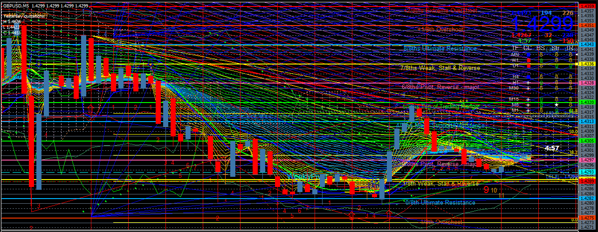
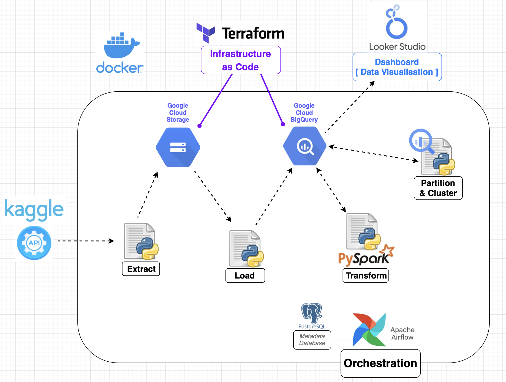
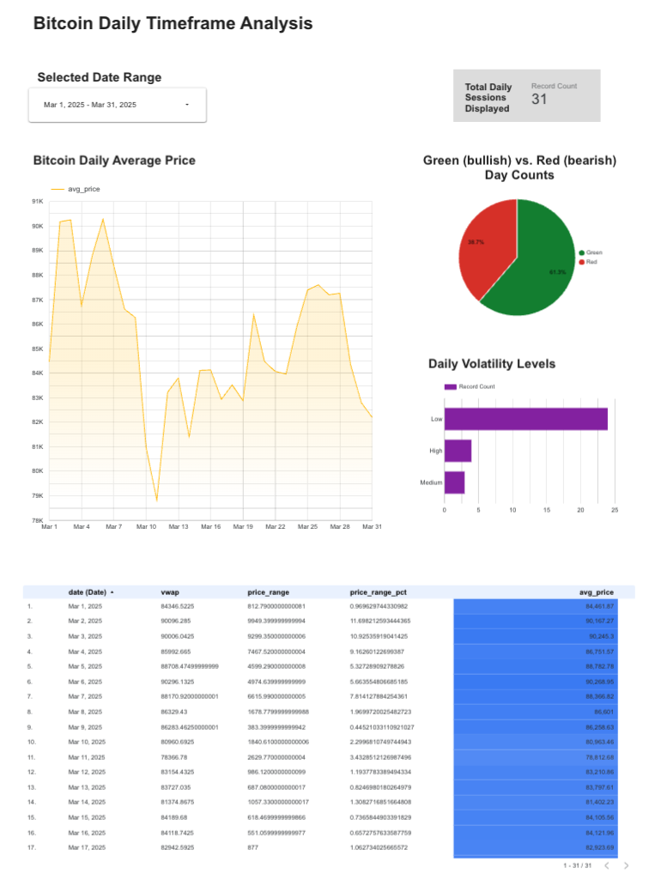

# Bitcoin Trading Data Pipeline ( Final-Project_DEZ2025 ) 
Hello there! Welcome to my Final Capstone Project for the Data Engineering Zoomcamp 2025!

FYI: This pipeline has been successfully executed multiple times via a new clean codespaces environment. It worked every time. If you have trouble setting-up, I recommend you to start a new codespaces for running this pipeline and follow along the steps in the [Setup Instructions](#setup-instructions)

For direct visual proof that this Pipeline is working, have a look at the section: [Other Screenshots & Videos](#other-screenshots-videos)

This Bitcoin Trading Data Pipeline fulfills all Data Engineering Zoomcamp 2025 criteria:
- **Problem Description**: Addresses trader/investor overwhelm with clear, organized metrics for swing trading/investing.
- **Cloud**: Leverages GCP (GCS, BigQuery) with Terraform for IaC.
- **Data Ingestion**: Fully automated Airflow DAG pulls Kaggle data to GCS and BigQuery.
- **Data Warehouse**: BigQuery tables (`raw_prices`, `daily_range`, `daily_range_partitioned`) are optimized with daily partitioning and volatility clustering.
- **Transformations**: PySpark computes trading metrics (`avg_price`, `vwap`, etc.).
- **Dashboard**: Looker Studio visualizes volatility distribution and price trends.
- **Reproducibility**: Detailed setup instructions ensure portability via Docker and Terraform.
Built with Python, Airflow, Docker, PostgreSQL, and Looker Studio, this scalable pipeline delivers actionable insights for Bitcoin investors & traders, ready for future enhancements like trading bots or data science.

## Table of Contents
- [Project Introduction](#project-introduction)
- [Project Overview](#project-overview)
- [Problem Description](#problem-description)
- [Tech Stack](#tech-stack)
- [(ELT) Pipeline Steps](#elt-pipeline-steps)
- [Data Warehouse](#data-warehouse)
- [Partitioning and Clustering](#partitioning-and-clustering)
- [Setup Instructions](#setup-instructions)
- [Outputs](#outputs)
- [Dashboard](#dashboard)
- [Future Scalability](#future-scalability)
- [Other Screenshots & Videos](#other-screenshots-videos)

### Project Introduction
This project delivers a fully automated, Dockerized data pipeline to analyze Bitcoin trading data from 2018 to present (updated daily as of April 2025).
Built with modern tools like Terraform, Airflow, and Docker, it’s portable, scalable, and ready for actionable trading metrics from daily candlesticks for Long-term Investing, Trading and Backtesting of Bitcoin.

### Project Overview
- **Goal**: Help traders and investors comprehend Bitcoin price volatility and trading activity with metrics like average price, price range, VWAP, candle color, volatility level.
- **Data**: Daily candlesticks (2018-2025) from Kaggle, updated daily via Binance API.
- **Workflow**: Extract (Kaggle API), Load (GCS/BigQuery), Transform (PySpark) — an **ELT** pipeline orchestrated by Airflow.

### Problem description
As a trader with 6+ years experience, I know it can be very confusing to have too much indicators drawn on a single trading chart. Over the years I experienced the concept of "less is more" on my trading charts to be real. Visual over-lays on candle stick charts can be nice, but can also be very overwhelming, leading to analysis-paralysis for a lot of traders/investors. 

 
_[An example of a trading chart with an overload of visual over-lays (indicators)]_

Also not all Data is always clearly shown on trading charts and it still requires precision to hover your mouse cursor over certain spots you want to see some actual metric-numbers about.

To have all this data neatly organised and presented with a Dashboard gives an advantage by keeping a clear overview when making trade decisions or while backtesting Trades on Bitcoin; without the issue of over overwhelming a trader/investor with too many stacked indicators on a single trading chart.

Most traders face losses, highlighting the need for clear, organized data over cluttered chart indicators. Besides a well developed strategy & mindset, the winning edge isn't found in having extra indicators stacked, but in proper and clear organisation of data, which will lead to a better comprehension of the price action. On chart indicators are often used in a visual relative way and— with X&Y-axis stretched/compressed to personal preferences —it can often be very misleading what a "big" or "small" candlestick or volume bar is. Actual data and numbers can be beneficial for advanced traders who prefer to dive deeper. This is what this data pipeline is providing to traders/investors who use the 1Day Timeframe (which is an important time frame for swing traders) to trade/invest in Bitcoin and backtest their Bitcoin trades/investments.

### (ELT) Pipeline Steps
  
1. **Extract**: 
It pulls the Raw Data (OHLCV market data with trade execution metrics) of the Bitcoin Daily Candle Timeframe from Kaggle’s [“Bitcoin Historical Datasets 2018-2025”](https://www.kaggle.com/datasets/novandraanugrah/bitcoin-historical-datasets-2018-2024?select=btc_1d_data_2018_to_2025.csv), 
   - **Tool**: Kaggle API (`kagglehub`).
   - **Action**: Pulls `btc_1d_data_2018_to_2025.csv` daily from Kaggle.
   - **Output**: Raw CSV uploaded to GCS (`gs://bitcoin-data-bucket-2025/raw/`).
2. **Load**: 
The Raw Data which has landed in a Google Cloud Storage bucket will then be loaded into BigQuery (Data Warehouse).
   - **Tool**: Google Cloud Storage → BigQuery.
   - **Action**: Loads raw CSV into BigQuery `raw_prices` table (schema autodetected, `WRITE_TRUNCATE`).
   - **Output**: `raw_prices` in BigQuery Dataset.
3. **Transform**: 
The Raw Data is then transformed with PySpark to Enhanced Data (Trading Metrics), and stored in Google BigQuery for trading insights.
   - **Tool**: PySpark.
   - **Action**: Computes metrics (`avg_price`, `price_range`, `price_range_pct`, `vwap`, `candle_color`, `volatility_level`) from `raw_prices`, saves to `daily_range`.
   - **Output**: `daily_range` in BigQuery Dataset.
4. **Partition and Cluster**:
   - **Tool**: BigQuery.
   - **Action**: Creates `daily_range_partitioned` from `daily_range`, partitioned by `DATE(date)` and clustered by `volatility_level`.
   - **Output**: `daily_range_partitioned` in BigQuery Dataset.

*Why ELT?* Data is loaded raw into BigQuery first (Load), then transformed with PySpark (Transform)—leveraging BigQuery’s storage and Spark’s processing power.

### Data Warehouse
The pipeline uses **Google BigQuery** as the data warehouse, storing data in three tables under your BigQuery Dataset:
- **`raw_prices`**: Raw Bitcoin candlesticks (~2,648+ rows, growing daily), unpartitioned to preserve original data integrity.
- **`daily_range`**: Intermediate table with trading metrics (`date`, `avg_price`, `price_range`, `price_range_pct`, `vwap`, `candle_color`, `volatility_level`), unpartitioned for flexibility during transformation.
- **`daily_range_partitioned`**: Optimized table for trading analysis, partitioned by `DATE(date)` (daily) and clustered by `volatility_level` (Low/Medium/High).

### Partitioning and Clustering
- **Partitioning by `DATE(date)`**:
  - **Why**: Bitcoin candlestick data is naturally daily, with one row per day representing a single candlestick. Partitioning by `DATE(date)` creates one partition per day, aligning perfectly with trading queries like “metrics for a specific date” (e.g., April 11, 2025) or date ranges (e.g., Q1 2025 trends). This ensures BigQuery scans only the relevant partitions, boosting performance for time-series analysis critical to swing traders.
  - **Why One Row per Partition**: With daily data, each partition holds one row by design, which is optimal for precision queries (e.g., “volatility on a single day”) and scales efficiently as new days are added. This avoids overcomplicating the schema with coarser partitions (e.g., monthly) that would mix unrelated days, reducing query specificity for traders.
  - **Benefit**: Fast filtering for dashboard visuals (e.g., `avg_price` trends) and backtesting (e.g., “Green days in 2025”).

- **Clustering by `volatility_level`**:
  - **Why**: `volatility_level` (Low: <3%, Medium: 3-7%, High: ≥7% `price_range_pct`) categorizes days by price movement intensity, a key trading signal. Clustering groups rows within each partition by volatility, speeding up queries like “high-volatility Green days” or “low-volatility trends in April 2025.”
  - **Benefit**: Enhances performance for dashboard filters and trading strategies focusing on volatility-driven decisions, such as identifying breakout opportunities.

This setup optimizes queries for my trading dashboard (e.g., “show `price_range_pct` for high-volatility days in 2025”) and ensures scalability as the dataset grows daily. Partitioning by date leverages the data’s natural structure, while clustering by volatility aligns with trader priorities, making `daily_range_partitioned` the go-to table for analysis.

### Tech Stack
- **Python**: Core language for scripting and DAG logic.
- **Apache Airflow**: Orchestrates the daily pipeline (extract, load, transform).
- **Docker**: Containers for Airflow, PySpark, and Postgres—ensures portability and consistency.
- **PostgreSQL**: Airflow’s metadata database (replaced SQLite for reliability).
- **Terraform**: Provisions Google Cloud infrastructure (GCS bucket, BigQuery dataset).
- **Google Cloud Platform (GCP)**:
  - **Google Cloud Storage (GCS)**: Stores raw CSV data).
  - **Google BigQuery**: Data warehouse for raw (`raw_prices`) and transformed (`daily_range`, `daily_range_partitioned`) tables.
- **PySpark**: Batch processes data into trading metrics.
- **Kaggle API**: Pulls the latest dataset (`btc_1d_data_2018_to_2025.csv`) via `kagglehub`.
- **Looker Studio**: Dashboard for visualizing price trends and volatility.

### Setup Instructions
#### Prerequisites
- Docker & Docker Compose
- Git
- Terraform
- Kagglehub

For Prereq Installation Guide, [click here](./prereqGuide.md)

#### API Credentials
- Google Cloud API credentials
- Kaggle API credentials

For API Credentials Obtaining Guide, [click here](./credentialsGuide.md)

#### Let's start!
1. **Clone the Repo**:
   ```bash
   git clone https://github.com/SpreadSheetStation/Final-Project_DEZ2025.git
   cd Final-Project_DEZ2025

#### Infrastructure & Preparation
1. **Set Up Log Directory**:
   - Create the log directory and set permissions for the Airflow user (UID 50000):
     ```bash
     mkdir -p docker-airflow-logs
     sudo chown -R 50000:50000 docker-airflow-logs
     ```
2. **Putting Keys in the right place**:
   - Gcp_key.json should be put in Final-Project_DEZ2025/Start/gcp_key/
   - Kaggle_key.json should be put in Final-Project_DEZ2025/Start/kaggle_key
3. **Edit the place holders in the Bash script run.sh**:
   - Inside Final-Project_DEZ2025/Start/ you will find the run.sh file. Edit this file by opening it and go to the '# User-editable variables' part where you will see this:
   ```bash
   # User-editable variables
   export GCS_BUCKET_NAME="placeHolder"
   export GCP_PROJECT_ID="placeHolder"
   export BQ_DATASET_NAME="placeHolder"

- Replace the placeHolder for each variable. Note: KEEP the quotaton marks!
- GCS_BUCKET_NAME: Think up a bucket name that is globally unique! Value can only contain lowercase letters, numeric characters, dashes (-), underscores (_), and dots (.)
- GCP_PROJECT_ID: This is the ID of your GCP project! Not sure which one this is? [click here](https://youtu.be/hwIXiVvD9vQ)
- BQ_DATA_NAME: Think up a BigQuery Dataset name
4. **Running the Bash script**:
   - Navigate to the Final-Project_DEZ2025/Start/ directory where you will find the run.sh file.
   - Run this file:
   ```bash
   chmod +x run.sh
   source ./run.sh

- Sets your environment variables and creates terraform.tfvars for your pipeline.

#### Run It
1. **Start Terraform**:
   - Navigate to the Final-Project_DEZ2025/terraform/ directory.
   - Start Terraform:
    ```bash
    terraform init
    terraform apply

- Builds your GCP Bucket & BigQuery Dataset.

2. **Start Docker**:
   - Start Docker:
    ```bash
    docker-compose up -d --build

- Builds bitcoin-pipeline-airflow:latest.
- Starts Postgres, Airflow webserver, scheduler, and initializes the DB.
- Automatically triggers the pipeline to run.

3. **Access Airflow UI**:
- Wait around 60-90 seconds first before Airflow UI can be successfully accessed
- URL: http://localhost:8080
- Login: admin / admin
- UI: Watch `crypto_pipeline` run (`pull_kaggle_data` → `load_to_bigquery` → `transform_data` → `partition_cluster_data`).

4. **[OPTIONAL] Manually (Re-)Trigger Pipeline**:
    ```bash
    docker exec <scheduler_container_id> airflow dags trigger crypto_pipeline

- Use the 'docker ps' command in your CLI first to find <scheduler_container_id> (e.g. final-project_dez2025-airflow-scheduler-1).

5. **Confirming a Succesful Pipeline Run**:
- Check the Airflow UI: If all the DAG tasks turn Green and status is 'success' the entire Pipeline ran successfully.
- Check Airflow Task Status via CLI for a recent run with 'state: success':
    ```bash
    docker exec final-project_dez2025-airflow-webserver-1 airflow dags list-runs -d crypto_pipeline
- Verify Outputs in GCS and BigQuery UI: Check if Bucket & BigQuery Dataset are filled succesfully

## Outputs
- **Infrastructure**: Terraform-managed GCS bucket (`bitcoin-data-bucket-2025`) and BigQuery dataset (`final-project-dez2025.crypto_data`).
- **GCS**: `gs://bitcoin-data-bucket-2025/raw/btc_1d_data_2018_to_2025.csv` (daily updated).
- **BigQuery**:
  - `raw_prices`: Raw OHLCV market data with trade execution metrics (~2,648+ rows, growing daily).
  - `daily_range`: Transformed metrics (`date`, `avg_price`, `price_range`, `price_range_pct`, `vwap`, `candle_color`, `volatility_level`).
  - `daily_range_partitioned`: Optimized for trading analysis, partitioned by `DATE(date)` and clustered by `volatility_level`—primary table for dashboard and queries.

## Dashboard
A Looker Studio dashboard visualizes Bitcoin trading metrics from `daily_range_partitioned`:
- **Access**: View [here](https://lookerstudio.google.com/reporting/2605b1fe-d7cd-48c0-87df-a038c8db0473)
- **Screenshot**:


## Future Scalability
This pipeline offers exciting potential for future enhancements to support advanced trading workflows:
- **Intraday Data**: Adding 4-hour or 1-hour candlesticks (e.g., via Binance API) could provide finer market insights, enabling day trading strategies and richer datasets for analysis.
- **Trading Bots**: Daily or intraday data in `daily_range_partitioned` (e.g., `candle_color`, `volatility_level`) could feed automated trading bots. For example, a bot might buy on “Green, High-volatility” periods, enhancing real-time swing or day trading.
- **Data Science**: Metrics like `avg_price`, `price_range_pct`, and `vwap`, especially with intraday granularity, could fuel predictive models (e.g., price trend forecasting) or pattern analysis (e.g., volatility clustering), unlocking deeper trading insights.
These possibilities leverage the pipeline’s flexible cloud architecture (GCP, Airflow) and clean data, setting the stage for scalable exploration as trading needs evolve.

## Other Screenshots Videos
Videos (Proof of a Green working Pipeline):
- https://www.youtube.com/watch?v=F5i35GIHSQA
- https://www.youtube.com/watch?v=9RP63lYncVk

Screenshots:
- [ALL GREEN: Airflow](./Images/Airflow.png)  
- [BigQuery](./Images/BigQuery.png)  
- [GCP](./Images/GCPbucket.png)  

